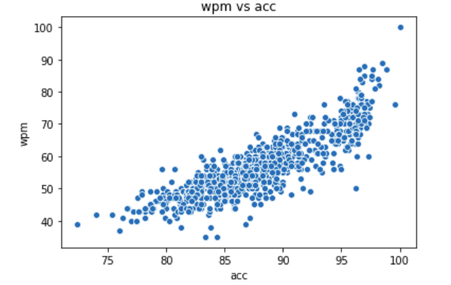

# TypeRacer Scraper / Analysis

## Scraper
Unfortunately the naive way of scraping by following public links does not work for the typeracer website because they keep a session id cookie that has to be supplied.
To get around this we use Selinium and simulate button presses that moves our scraper between pages.  
From this we can scrape the ~820 races associated with my account.  

## Analysis
First we had to format the data, dates were stored as text so we changed those into datetime objects and from there we calculated how many days since I created the account. Using days since creation as a time axis we can see a general improvement in my accuracy and wpm. The large time jump between data points is my first/second year of college, its clear that typing all day for school really improved my skills.  

One of the most interesting Relationships in my opinion though is how wpm and accuracy interact. Is it true that one of the ways to become faster is slowing down and being more accurate when you're typing? The data below would suggest that but we have to account for the confounding variable that is time. As time increases both my accuracy and wpm increased. To check for that confounding variable, I made a model that included time and it found that even with time included, it was still significant to include accuracy. Therefore we can say for sure that when I increased my accuracy I was increasing my wpm by doing so

